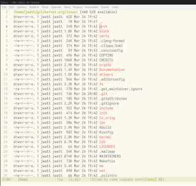
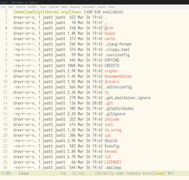

# fff.el

An Emacs frontend for [fff.nvim](https://github.com/dmtrKovalenko/fff.nvim) — a fast, typo-resistant fuzzy file finder with frecency scoring, git status integration, and live grep. This package calls directly into `libfff_c.so`, the C FFI shared library from the fff.nvim project, using [tromey/emacs-ffi](https://github.com/tromey/emacs-ffi).

```
C-c f f  →  fuzzy file picker
C-c f g  →  live grep
```
## fff-find-file


## fff-grep


---

## Architecture

```
┌─────────────────────────────────────────────────────────────┐
│  Emacs                                                      │
│                                                             │
│  fff.el          — FFI bindings, search, backend protocol   │
│  fff-helm.el     — Helm UI backend                          │
│                                                             │
│  emacs-ffi       — libffi bridge (tromey/emacs-ffi)         │
└──────────────────────────┬──────────────────────────────────┘
                           │  dlopen + C ABI
                           ▼
                ┌─────────────────────┐
                │   libfff_c.so       │
                │   (Rust, cdylib)    │
                ├─────────────────────┤
                │  • file index       │
                │  • fuzzy search     │
                │  • live grep        │
                │  • frecency LMDB    │
                │  • git status       │
                └─────────────────────┘
```

### Why direct FFI instead of a socket/process?

fff.nvim ships three consumer interfaces: a Neovim Lua module (`libfff_nvim.so`), an MCP server binary (`fff-mcp`), and a **C FFI shared library** (`libfff_c.so`) intended for any language with C FFI support — Bun, Node.js, Python, and now Emacs. The C library has a synchronous API with no async runtime, making it a natural fit for `emacs-ffi`'s `define-ffi-function`.

### Key API facts

- Every `fff_*` function returns `*mut FffResult` — a `repr(C)` envelope with `success`, `error`, `handle`, and `int_value` fields. The `fff--with-result` macro handles checking and freeing this automatically.
- Results are **not JSON** — they are `repr(C)` structs accessed via getter functions (`fff_search_result_get_item`, `fff_grep_result_get_match`). We read field values with `ffi--mem-ref` at computed byte offsets.
- The `FffInstance` is an opaque `void*` created by `fff_create_instance` and destroyed by `fff_destroy`. All other functions take this handle as their first argument.
- Memory is caller-managed: `fff_free_result` frees the envelope, `fff_free_search_result` / `fff_free_grep_result` free the payload, separately.

---

## Installation

### With Makefile

Because fff.el relies on compiled Rust and C binaries, a robust Makefile is provided that handles compiling both dependencies, linking them for your specific OS (Linux .so or macOS .dylib), and installing them into a self-contained directory.

1. Prerequisites

Ensure your system has the required build tools:

- **Rust + Cargo:** rustup.rs
- **Emacs 28.1+:** Must be built with dynamic module support (--with-modules)
- **C Compiler:** gcc or clang
- **libltdl & libffi headers:**
    - *Fedora/RHEL:* sudo dnf install libtool-ltdl-devel libffi-devel
    - *Ubuntu/Debian:* sudo apt install libltdl-dev libffi-dev
    - *macOS:* brew install libtool libffi

2. Build and Install

Run the included Makefile. It will automatically download fff.nvim, compile the Rust core, compile the C FFI bridge, patch macOS library links (if applicable), and install everything to `~/.emacs.local/emacs-fff`.

```bash
# Verify your system has the correct dependencies
make check

# Build the binaries and install them to ~/.emacs.local/emacs-fff
make install
```

*(Optional overrides: You can change the install path by running `make install INSTALL_DIR=/your/custom/path`)*

3. Emacs Configuration

Because the build process makes the binaries fully relocatable, you do not need to set LD_LIBRARY_PATH or use wrapper scripts. Just point Emacs to the installation directory.

#### Option A: For use-package users (Recommended)

```emacs-lisp
(use-package fff-consult ; or fff-helm or fff-ivy
  :straight nil
  :load-path "~/.emacs.local/emacs-fff"
  :commands (fff-find-file fff-grep) 
  :bind (("C-c f f" . fff-find-file)
         ("C-c f g" . fff-grep))
  :config
  ;; fff-consult already requires fff and ffi internally
  (require 'consult) 
  (consult-customize fff-grep :preview-key '(:debounce 0.4 any)))
```

#### Option B: For Vanilla Emacs users

```emacs-lisp
(add-to-list 'load-path (expand-file-name "~/.emacs.local/emacs-fff"))
(require 'fff-consult) ; or fff-helm, fff-ivy, etc.

(global-set-key (kbd "C-c f f") #'fff-find-file)
(global-set-key (kbd "C-c f g") #'fff-grep)
```

---

## Usage

| Command | Description |
|---|---|
| `M-x fff-find-file` | Fuzzy file picker for the current project |
| `M-x fff-grep` | Live grep (plain text by default) |
| `M-x fff-grep-word-at-point` | Grep for the word under the cursor |
| `M-x fff-change-directory` | Set a fallback root when outside a git repo |
| `M-x fff-refresh` | Trigger a rescan of the project tree |
| `M-x fff-refresh-git` | Refresh git status cache |
| `M-x fff-stop` | Destroy the fff instance and free memory |

### Project root detection

fff automatically uses the git root of the current buffer's directory, and switches automatically when you move to a buffer in a different git repo.

If you're outside a git repo, use `M-x fff-change-directory` to set a fallback root. This sets `fff-default-directory` which persists for the session. You can also set it permanently in your config:

```elisp
(setq fff-default-directory "~/projects/myrepo")
```

The resolution order is:

1. Git root of the current buffer (auto-detected)
2. `fff-default-directory` (set by `fff-change-directory`)
3. Error with a helpful message

---

## Configuration

```elisp
(setq fff-max-results    100)   ; max results returned per search
(setq fff-max-threads    0)     ; worker threads (0 = auto-detect)
(setq fff-smart-case     t)     ; case-insensitive when query is lowercase

;; Share frecency databases with the Neovim plugin for cross-editor scores
(setq fff-frecency-db-path "~/.cache/fff_nvim")
(setq fff-history-db-path  "~/.local/share/fff_queries")

;; Fallback root when outside a git project
(setq fff-default-directory nil) ; set to a path string to enable
```

---

## Backend system

fff.el separates the data layer (FFI calls, result collection) from the UI layer (completion framework). The active backend is set via `fff-backend`.

### Built-in backends

| File | Backend variable | Framework |
|---|---|---|
| `fff-helm.el` | `fff-backend-helm` | [helm](https://github.com/emacs-helm/helm) |
| `fff-ivy.el` | `fff-backend-ivy` | [ivy](https://github.com/abo-abo/swiper)
| `fff-consult.el` | `fff-backend-consult` | [consult](https://github.com/minad/consult)
| *(built-in)* | `fff--make-default-backend` | `completing-read` |

Loading `fff-helm.el` automatically sets `fff-backend` to `fff-backend-helm`.

### Writing your own backend

A backend is a plist with two keys:

```elisp
(setq my-backend
  (list
   :pick-file
   (lambda (candidate-fn action-fn)
     ;; candidate-fn: (lambda (query) ...) → list of (display . plist)
     ;; action-fn:    (lambda (plist) ...)  — called with the chosen result
     ...)

   :pick-grep
   (lambda (candidate-fn action-fn)
     ...)))

(setq fff-backend my-backend)
```

The public functions your backend should call:

- `(fff-file-candidates QUERY)` → list of `(path . plist)` cons cells
- `(fff-grep-candidates QUERY)` → list of `("path:line:col  content" . plist)` cons cells
- `(fff-open-result PLIST)` → opens the file, records frecency

### Helm backend notes

The helm backend uses top-level `defun`s for `:candidates` rather than lambdas. This is required because helm evaluates candidate functions in a dynamic binding context where anonymous lambdas that reference other functions by name fail with `void-function`. The named functions `fff--helm-candidates` and `fff--helm-grep-candidates` are always findable by symbol lookup.

---

## Development

### Reloading after edits

`define-ffi-function` uses `defun` internally, so reloading with `load-file` won't rebind already-defined symbols. Use the provided reload helpers instead:

```elisp
;; Reload fff core (preserves fff-backend across reload)
M-x fff-reload

;; Reload helm backend
M-x fff-helm-reload
```

### Verifying the setup

```elisp
;; Check the library opened
(fff--lib)             ; should return a user-ptr

;; Check the instance
fff--instance          ; user-ptr after first fff-find-file
fff--current-base-path ; your project root

;; Check the backend
fff-backend            ; should be a plist, not nil
(featurep 'fff-helm)   ; t if using helm
(fboundp 'fff--helm-candidates) ; t if helm backend loaded correctly
```

### Struct offsets reference

The C struct layouts are documented in comments at the top of `fff.el`. The key offsets used for reading results:

| Struct | Field | Offset | Type |
|---|---|---|---|
| `FffResult` | `error` | 8 | `:pointer` |
| `FffResult` | `handle` | 16 | `:pointer` |
| `FffResult` | `int_value` | 24 | `:int64` |
| `FffFileItem` | `path` | 0 | `:pointer` |
| `FffFileItem` | `git_status` | 24 | `:pointer` |
| `FffSearchResult` | `count` | 16 | `:uint32` |
| `FffGrepResult` | `count` | 8 | `:uint32` |
| `FffGrepMatch` | `path` | 0 | `:pointer` |
| `FffGrepMatch` | `line_content` | 32 | `:pointer` |
| `FffGrepMatch` | `line_number` | 104 | `:uint64` |
| `FffGrepMatch` | `col` | 120 | `:uint32` |

If fff.nvim changes its struct layouts in a future version, update the offset constants in the `;;; Struct field readers` section of `fff.el`.

---

## Troubleshooting

**Binary/Module Not Found Errors**

If Emacs complains that it cannot load `ffi-module` or `libfff_c`, it is almost always a build/compilation issue rather than an Emacs config issue.

1. Ensure you ran make install and that it completed without errors.

2. Verify the binaries exist in your installation directory (default: `~/.emacs.local/emacs-fff`).

3. If you moved the binaries manually after running make, **don't**. Run `make install INSTALL_DIR=/new/path` instead so the dynamic linker paths remain intact (especially critical on macOS).
	
**`fff-find-file` errors: "not in a project"**

Run `M-x fff-change-directory` to set a fallback root, or add to your config:
```elisp
(setq fff-default-directory "/path/to/your/project")
```

**No candidates appear in helm**

Run `M-x fff-helm-reload` to ensure the helm functions are freshly bound, then verify:
```elisp
(fboundp 'fff--helm-candidates)  ; must be t
fff-backend                       ; must be non-nil
fff--instance                     ; must be a user-ptr
```

**Emacs crashes when calling fff functions**

Most likely a `uint64` argument is being mishandled by libffi. The `fff--wait-for-scan-poll` function intentionally avoids calling `fff_wait_for_scan` directly (which can crash with large `uint64` values on some libffi versions) and instead polls `fff_is_scanning` in a loop.

**`void-function` errors in helm candidates**

This happens when helm evaluates candidate functions in its dynamic binding context. The fix is already applied — candidate functions must be top-level `defun`s passed as quoted symbols (e.g. `'fff--helm-candidates`), not anonymous lambdas. If you see this after editing `fff-helm.el`, run `M-x fff-helm-reload`.

**`straight-pull-recipe-repositories` error when configuring**

If you use `straight.el` for package management (especially with `straight-use-package-by-default` set to `t`), it will intercept the `use-package` declaration and attempt to download `fff-consult` or `fff-helm` from MELPA/GitHub. Since this is a local installation, it will fail with a "Could not find package" error.

To fix this, explicitly tell `straight` to ignore the package by adding `:straight nil` to your declaration:

```elisp
(use-package fff-consult
  :straight nil  ; Required if using straight.el
  :load-path "~/.emacs.local/emacs-fff"
  :commands (fff-find-file fff-grep)
  :bind (("C-c f f" . fff-find-file)
         ("C-c f g" . fff-grep)))
```
